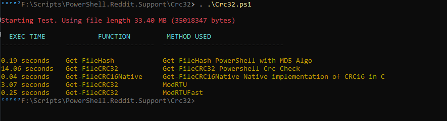

# Crc Check in PowerShell

## PowerShell CRC Implementation

Simple Implementation of CRC check. Was made to be faster than ```Get-FileHash``` this was a failure.

## Functions

### Wrapper Function

- Get-FileCRC32 : Wrapper function, takes a file path as argument and the ```Algorithm```
    - **Block32** is the ```Get-CRC32``` implementation
    - **ModRTU** is the Modbus RTU implementation in ```Get-CRCModRTU```
    - **ModRTUFast** is the Modbus Simple/Fast RTU implementation in ```Get-CRCModRTUFast```


### CRC Functions

- Get-CRCModRTU
- Get-CRCModRTUFast
- Get-CRC32

### CRC Native (in C)

- Get-FileCRC16Native

### Test Functions

- Test-CRC32
- Get-TimeEvaluationForCrc

## Performance Test Results



## Native CRC Implementation

The exe in ```tools``` folder is used in the ```Get-FileCRC16Native``` function. From [Console.CrcCheck](https://github.com/arsscriptum/Console.CrcCheck)