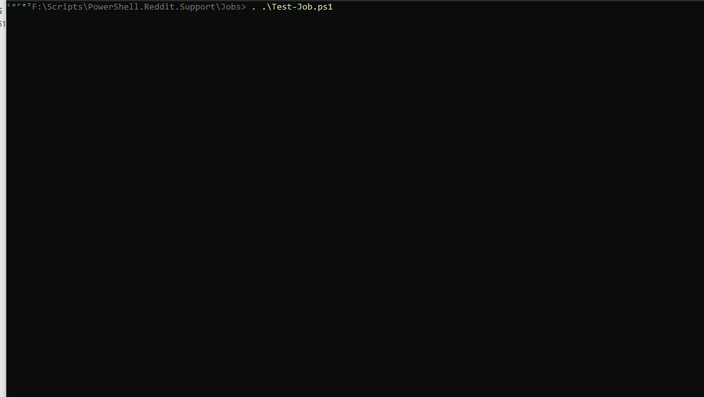

# Demo of PowerShell JOB

From [this post](https://www.reddit.com/r/PowerShell/comments/16s6q7v/is_it_possible_to_retrieve_a_variable_from_a/) . 

*Is it possible to retrieve a variable from a running job w/o waiting for its completion?*

## Simple Job 

This job is based on a timer, it will run for a pre-defined amount of seconds.

## Receving data from running jobs

To get the updated variables from the running job, you first output the data from the job with ```Write-Output```. Then, you use the function ```Receive-Job```, this function will get the output from the running job. 

1. Job outputs data in the ```stdout``` stream via ```Write-Output```
2. Other thread uses ```Receive-Job``` to get the outputed data.
3. Data conversion if required.


## Returning complex objects from jobs.

You can also return ```pscustomobject``` to make it easier to return more structured data.

In this example, at every loop in the job script, I create a ```pscustomobject``` in which i put all the values I want to return from the job during its execution. 
Here I return the **progress percentage** and the **elapsed milliseconds** . 

I convert my  ```pscustomobject``` in a JSON string and I return it via ```Write-Output```


```powershell
	$obj = [pscustomobject]@{
		percentage              = $percentage
		elapsed_milliseconds    = $elapsed_milliseconds
	}
	[string]$str_output = $obj | ConvertTo-Json -Compress
	Write-Output($str_output)
```

## Receiving data updates from job

Here's how you get the data from the job

```powershell
	$Output = Receive-Job -Name $JobName
	$line_out = $Output | Select-Object -Last 1
	# PARSING THE JSON STRING
	$job_variable_object = $line_out | ConvertFrom-Json
```

---------------------------------------


Regarding communication between the job and the main thread, you can do it simply by using a file.

I have implemented it in [Test-Job.ps1](https://github.com/arsscriptum/PowerShell.Reddit.Support/blob/master/Jobs/Test-Job.ps1)

It looks like this, in the job:

```powershell

  function CheckJobCmd{
    try{
      [uint32]$Value = Get-Content -Path "$ENV:Temp\job_pipe_file" -Raw -Force -ErrorAction Ignore
      if($Null -eq $Value){ return 0 }
      # reset to 0
      Set-Content -Path "$ENV:Temp\job_pipe_file" -Value 0 -Force -ErrorAction Ignore
      return $Value
     }catch{ $Value = 0 }
   return $Value
  }
  while ... {
    [uint32]$state = CheckJobCmd
    if($state -eq 1){
      # ...do stuff
    }elseif($state -eq 2){
      # ...do other stuff
    }
  }

```

In the main thread

```powershell

  function SetJobCmd([uint32]$cmd){
    try{
      if(-not(Test-Path -Path "$ENV:Temp\job_pipe_file" -PathType Leaf)){
        $Null = New-Item -Path "$ENV:Temp\job_pipe_file" -ItemType File -Force -ErrorAction Ignore
      }
      Set-Content -Path "$ENV:Temp\job_pipe_file" -Value $cmd -Force -ErrorAction Ignore
    }catch{}
  }

  # send a cmd to the job...
  SetJobCmd(2)

```

---------------------------------------


## To Test

```powershell
  . .\Test-Job.ps1
```

## Example 1: Debug the JSON Object

Here I output the ```JSON Object``` string that is returned from the job at every loop.


## Example 2: Output the Converted JSON Object

Here I output the ```JSON Object```  that is returned from the job at every loop **AFTER it is converted** back to a ```pscustomobject``` .


## Example 3: Output use the data to update a progress bar

Here I use the data from the ```JSON Object``` to update a progress bar




