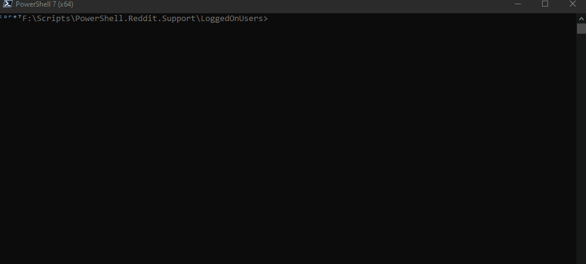

# Get Logged On Users

PowerShell Script that uses [PsLoggedOn](https://learn.microsoft.com/en-us/sysinternals/downloads/psloggedon) to list the logged on users, locally or on a server.

In reply to [this post](https://www.reddit.com/r/PowerShell/comments/16rx0vw/export_list_of_logged_on_users/)

## Functions

**Install-PsLoggedOn**

Install the ```PsLoggedOn.exe``` Program

**Search-PsLoggedOnApp**

Search for the  ```PsLoggedOn.exe``` Program on the computer

**Get-LoggedOnUsers**

Get the list of logged on users using the ```PsLoggedOn.exe``` Program. Parse the output in ```PsCustomObjects```


## Example Usage

Here's a test function using the function above

```powershell

	function Test-GetLoggedOnUsers { 
	    [CmdletBinding(SupportsShouldProcess)]
	    param()

	    process{
	      try{
	        Write-Hosts "Retrieving Local LoggedOn Users..."
	        $local = Get-LoggedOnUsers
	        $CsvData = $local | ConvertTo-Csv
	        
	        $ExportPath = "{0}\export" -f "$PSScriptRoot"
	        $Null = New-Item -Path "$ExportPath" -ItemType Directory -Force -ErrorAction Ignore
	        $ExportFilePath = "{0}\LocalUsers.csv" -f $ExportPath
	        Write-Hosts "Exporting Local LoggedOn Users to `"$ExportFilePath`""
	        Set-Content -Path "$ExportFilePath" -Value $CsvData -Force -ErrorAction Ignore

	        Write-Hosts "------------------------------------------------"
	        Write-Hosts "Get-LoggedOnUsers `"DESKTOP-JIRMI11`""
	        

	        Write-Hosts "Retrieving Remote LoggedOn Users..."
	        $RemoteUsers = Get-LoggedOnUsers "DESKTOP-JIRMI11"
	        $CsvData = $local | ConvertTo-Csv
	        
	        $ExportPath = "{0}\export" -f "$PSScriptRoot"
	        $Null = New-Item -Path "$ExportPath" -ItemType Directory -Force -ErrorAction Ignore
	        $ExportFilePath = "{0}\RemoteUsers.csv" -f $ExportPath
	        Write-Hosts "Exporting Remote LoggedOn Users to `"$ExportFilePath`""
	        Set-Content -Path "$ExportFilePath" -Value $CsvData -Force -ErrorAction Ignore
	        Write-Host "Done!" -f Green
	       
	      }catch{
	        throw $_
	      }
	    }

	}

```




-----------------------


## Installing PSLoggedOn

The installation is done automatically if the file is not locacted on the computer. It is very fast. 

1. Downloads the ```https://download.sysinternals.com/files/PSTools.zip``` packages from sysinternals.
2. Unpack the files to TEMP folder
3. Copy the PsLoggedOn.exe Program to Destination folder.

### Example


