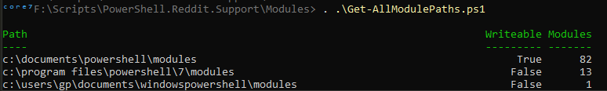

# Get Module Paths

Functions to get the module paths and check if they are writable or not, and the number of modules they contain.





```powershell

	function Get-WritableModulePath{
	    [CmdletBinding(SupportsShouldProcess)]
	    param(
	        [Parameter(Mandatory=$false, ValueFromPipeline=$true, HelpMessage="Permissions")]
	        [string[]]$Permissions=@('Modify','FullControl','Write')
	    )
	    $VarModPath=[System.Environment]::GetEnvironmentVariable("PSModulePath")
	    $Paths=$VarModPath.Split(';')

	    Write-Verbose "Get-WriteableFolder from $Path and $PathsCount childs"
	    # 1 -> Retrieve my appartenance (My Groups)
	    $id = [Security.Principal.WindowsIdentity]::GetCurrent()
	    $groups = $id.Groups | foreach-object {$_.Translate([Security.Principal.NTAccount])}
	    $GroupList = @() ; ForEach( $g in $groups){  $GroupList += $g ; }
	    Sleep -Milliseconds 500
	    $PathPermissions =  [System.Collections.ArrayList]::new()   

	    $aclfilter_perm = {
	        $ir=$_.IdentityReference;$fsr=$_.FileSystemRights.ToString();$hasright=$false;
	        ForEach($pxs in $Permissions){ if($fsr -match $pxs){$hasright=$True;}};
	        $GroupList.Contains($ir) -and $hasright
	    }
	    ForEach($p in $Paths){
	        if(-not(Test-Path -Path $p -PathType Container)) { continue; }
	        $perm = (Get-Acl $p).Access | Where $aclfilter_perm | Select `
	                                 @{n="Path";e={$p}},
	                                 @{n="IdentityReference";e={$ir}},
	                                 @{n="Permission";e={$_.FileSystemRights}}
	        if( $perm -ne $Null ){
	            $null = $PathPermissions.Add($perm)
	        }
	    }

	    return $PathPermissions
	}

	function Get-AllModulePaths{
	    [CmdletBinding(SupportsShouldProcess)]
	    Param()
	    $VarModPath=$env:PSModulePath
	    $Paths=$VarModPath.Split(';').ToLower()
	    $WritablePaths=(Get-WritableModulePath).Path.ToLower()
	    $Modules = [System.Collections.ArrayList]::new()
	    ForEach($dir in $Paths){
	        if(-not(Test-Path $dir)){ continue;}
	        $Childrens = (gci $dir -Directory)
	        $Mod = [PSCustomObject]@{
	                Path            = $dir
	                Writeable        = $WritablePaths.Contains($dir)
	                Modules         = $Childrens.Count
	            }
	        $Null = $Modules.Add($Mod)
	    }
	    return $Modules
	}
```