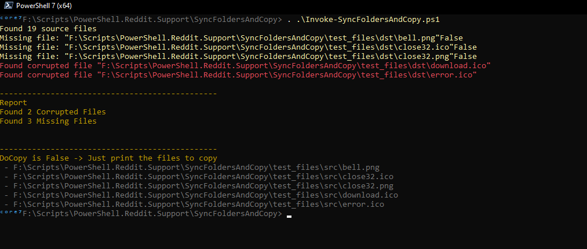

# Sync Folders And Copy

From [this question](https://www.reddit.com/r/PowerShell/comments/16q70vz/powershell_recursively_find_files_in_directories/) where the user wants to do the following

1. Do a GCI call in the location with intact files, to figure out what all the filenames are
2. Do a second GCI call in the location with corrupt files, to figure out what all those filenames are
3. Where it finds a match between the two, I want it to copy from the first location (the folder with the flat structure), to the location where it found the match in the second, thus overwriting the corrupt file with the intact one


The ```Invoke-SyncFoldersAndCopy``` function gets the list of files from dir 1. Then checks if that file exists in the corrupted files folder, if it dones, it will diff the HASH of both files to make sure they are the same.
If the file doesn't exists, or the file hashes are different, it will copy the file from dir1 to dir2. You need to set the ```DoCopy``` argument to ```$True``` for the copy to happen.


## Test

I have added a list of files for testing in ```test_files``` . Both ```src``` and ```dst``` directories contains the same files except that in ```dst``` there is 2 corrupted files and 3 missing files.


